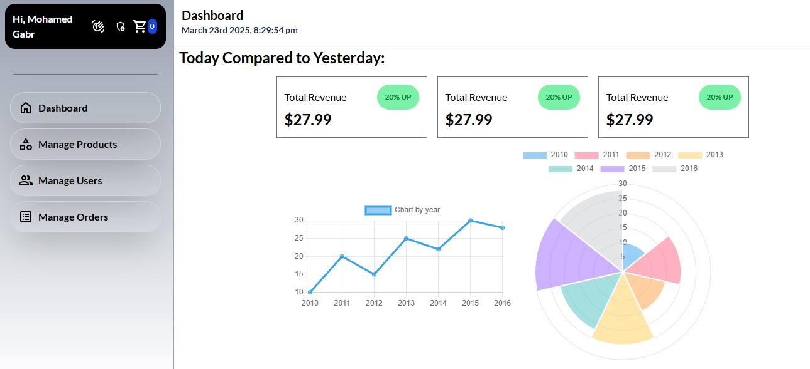

<h1 align="center">
    Hi 👋, my name is Mohamed Gabr
</h1>
<h3 align="center">
    I'm a Full-Stack web developer
</h3>




# The Project
- A Full-Stack Ecommerce website. That can handle all of the ecomm user features. Featuring seamless payment processing through Stripe, you have the capability to purchase order from you shopping cart. With an admin side dashbourd where you have a full mangement system.

---
# Tech Stack
- React JS
- Redux
- Node JS
- Express JS
- JWT
- Passport JS
- Tailwind CSS
- Mongo DB / Mongoose
- Cloudinary
- Stripe
- Nodemailer
- Chart JS
- GSAP for animations
---

# Code Overview
## 1. Front-end
1. Modern Design and cool animations using 👉 Tailwind Css and GSAP.
2. State management using Redux
3. Managing the connection between the front-end and the back-end and fetching data using Redux RTK Query
4. Full user Authentication System
5. Real Payments using stripe

## 2. Back-end
1. Clean folder structure
2. Authentication Functions using 👉 Cookies, JWT, Mongoose, Passport JS
3. Error Handling for all routes

# Highlights
- 🌟 Tech stack: MERN Stack
- 🎃 Authentication && Authorization with JWT
- 🐞 Error handling both on the server and on the client
- ⏳ And much more!
---

# App Features
👉 Authentication System: User management through Mongo DB database, ensuring secure and efficient authentication.
(Full User Authentication System)
- Sign UP
- Sign IN
- Forget Password 👉 Using user Email to send a reset password link
- Reset password 👉 Using a reset link that is valid to use for only one time
- Login with Google

👉 Modern Design & Animations

👉 Ecommerce
- Cart (add product , remove product, clear cart)
- Checkout using Stripe

👉 Search
- You can search to find any product you want using the search bar in the header

👉 Full Management System (Admin Side)
- Products Management (CRUD)
  - Create a product
  - Shows all products in one place
  - Update any product
  - Delete any product

- Users Management
  - Shows all users in one place
  - Block any user

- Orders management
  - A dashboard where you can see every order with all data you need like the order products, user id, stripe customer id, amount of money and more

# Pages
- Home
- Product details
- Shopping cart
- Register page
- Login page
- Forget password page
- Reset password page
- Checkout page
- Checkout success page
- Add product form page
- Edit product form pag
- Admin dashboard

# Quick Start
1. Step 1: Clone this repo
```bash
git clone git@github.com:MO-GBR/smart_ecom_website.git
```
2. Step 2: ENV Files
- Client
```bash
VITE_API_URL="http://localhost:5000/api"
VITE_MODE="production"
VITE_STRIPE_PUBLIC_KEY=
```
- Api
```bash
PORT=5000
MONGO_DB_URI=
JWT_SECRET=
EMAIL_SERVICE=
EMAIL_USERNAME=
EMAIL_PASSWORD=
EMAIL_FROM=
CLIENT_URL="http://localhost:5173"
CLOUDINARY_CLOUD_NAME=
CLOUDINARY_API_KEY=
CLOUDINARY_API_SECRET=
GOOGLE_CALLBACK_URL="http://localhost:5000/api/oauth/google/callback"
GOOGLE_CLIENT_ID=
GOOGLE_CLIENT_SECRET=
STRIPE_PUBLIC_KEY=
STRIPE_SECRET_KEY=
NODE_ENV="production"
```
3. Step 3: Run this Command
```bash
cd smart_ecom_website && npm run build && npm run start
```
- It will do 5 things
  1. Access the smart_ecom_website folder.
  2. Install dependencies in the api folder.
  3. Install dependencies in the client folder.
  4. Build the dist folder in the client (Front-end).
  5. Start the Api Server (Back-end).

4. Step 4: Open http://localhost:5000/ on your browser